# Модель інформаційних процесів і дослідження затримки

## Межі моделі

Розглядається маршрут телеметрії від сформованого відліку датчика до кадру 3D-інтерфейсу. Відповідність компонентів узгоджено з `components.mmd`: DataCollection, MQTT-брокер, ResourceAccess, DataQuality, TwinManagement та UserApplication. Вхідні цілі взято з [requirements.md](requirements.md): NFR-01 — p95 не більше 250 мс до стану в API; NFR-02 — p95 не більше 500 мс до відображення кутів S-01…S-06.

**Наведені затримки — проєктні припущення для порівняння варіантів, а не виміряні результати, паспортні характеристики чи числа зі статей.** Попередні файли не визначали конкретного способу оновлення інтерфейсу через API. Для базового сценарію цього дослідження прийнято опитування кожні 200 мс; для Г-01 — передавання оновлень через WebSocket.

Базове навантаження — один манекен, 171 періодичний відлік/с плюс події та повідомлення працездатності. Модель описує час проходження одного відліку; це не сума витрат процесора на оброблення кожного повідомлення. Пропускну здатність 200 відліків/с і масштабування до 10 емуляторів вона не доводить.

Початок відліку часу t0 — момент формування значення на джерелі, а не початок фізичного руху. Тому очікування наступного опитування датчика до t0 не включено. Для кутів із частотою 10 Гц таке додаткове очікування може становити до приблизно 100 мс; воно стосується іншої метрики «фізична зміна — відображення».

## Маршрут даних



Основний маршрут: сформований відлік → DataCollection → MQTT-брокер → ResourceAccess → DataQuality → TwinManagement → UserApplication.

- DataCollection пакує відлік з ID джерела, ID сигналу й часовою міткою.
- MQTT-брокер приймає та доставляє повідомлення підписнику.
- ResourceAccess приймає й декодує повідомлення; DataQuality перевіряє його структуру, діапазони та часові мітки. Некоректні відліки не оновлюють стан.
- TwinManagement оновлює фактичний стан, доступний через API. Старіші відліки не перезаписують новіший стан.
- UserApplication отримує стан і відображає кути у 3D-моделі. Історія не є джерелом оперативного відображення.

Керуючі команди та локальна аварійна реакція мають інші маршрути. Затримка телеметрії не є часом спрацювання аварійної зупинки.

## Послідовні ділянки та вихідні припущення

| Ділянка | Перетворення та пояснення оцінки | Очікувана затримка, мс |
|---|---|---:|
| Сформований відлік → DataCollection | Приймання готового значення, присвоєння ID, коротка буферизація й пакування. Прийнятий бюджет — 15 мс. | 15 |
| DataCollection → MQTT-брокер | Публікація, транспортування, приймання брокером з урахуванням налаштованого доступу. Прийнятий бюджет — 25 мс. | 25 |
| MQTT-брокер → стан у API | Доставка до ResourceAccess і декодування — 15 мс; DataQuality — 10 мс; застосування стану в TwinManagement і доступність через API — 15 мс. | 40 |
| Стан у API → UserApplication | Середнє очікування опитування: 200 / 2 = 100 мс; відповідь API, розбір і перший кадр із цим станом — ще 20 мс. | 120 |
| **Разом до стану в API** | **Перші три ділянки** | **80** |
| **Разом до відображення** | **Усі чотири ділянки** | **200** |

Бюджети 15, 25 і 40 мс залишають місце для планування задач, передавання й оброблення на навчальному стенді; їх обрано для початкової моделі та потрібно замінити виміряними значеннями в наступних роботах. Тривалість кадру, складність сцени та мережеві умови можуть змінити останню ділянку.

Оцінка T/2 для опитування передбачає рівномірний розподіл моменту оновлення стану відносно циклу опитування. У синхронізованому генераторі 10 Гц і клієнті 5 Гц фаза може бути сталою; тоді очікування потрібно вимірювати, а не автоматично прирівнювати до T/2. Саме опитування раз на 200 мс також може пропускати проміжні відліки кутів із періодом 100 мс; ці пропуски враховуються під час перевірки гіпотези.

## Паралельні гілки

| Гілка | Призначення | Очікувана затримка, мс | Участь у сумі |
|---|---|---:|---|
| DataQuality → історичне сховище | Асинхронний запис прийнятої телеметрії; старі валідні відліки можуть зберігатися без оновлення поточного стану. | 60 | Не входить: UI не очікує завершення запису. |
| ResourceAccess / DataQuality → журнал | Асинхронна реєстрація подій та помилок. Звичайний коректний відлік не обов’язково утворює окремий запис журналу. | 20 | Не входить: журнал не є передумовою оновлення 3D-моделі. |

Ці числа також є припущеннями. Постановку задачі асинхронного запису враховано в бюджеті оброблення; час завершення запису не додається. Якщо запис блокує маршрут або через спільні ресурси створює черги, відповідна затримка повинна бути включена до виміряного основного маршруту. Якщо інтерфейс чекатиме збереження історії, додаткові 60 мс стануть послідовними: у спрощеній моделі 200 + 60 = 260 мс.

## Розрахунок і зіставлення з вимогами

`Lsync = 15 + 25 + 40 = 80 мс`

`Le2e = 15 + 25 + 40 + 120 = 200 мс`

| Показник | Розрахункова оцінка | Ціль вимоги | Висновок для моделі |
|---|---:|---:|---|
| До стану в API | 80 мс | NFR-01: p95 ≤ 250 мс | Оцінка нижча за числову межу на 170 мс. |
| До кадру інтерфейсу | 200 мс | NFR-02: p95 ≤ 500 мс | Оцінка нижча за числову межу на 300 мс. |

**Це попереднє зіставлення бюджетів, а не підтвердження NFR.** Скрипт підсумовує фіксовані оцінки, а NFR визначені для 95-го перцентиля експериментальних затримок. Він не моделює їхній розподіл; сума окремих p95 також не дорівнює автоматично p95 повного маршруту. Для перевірки потрібні часові мітки повних проходжень відліків.

Найбільша ділянка — «стан у API → UserApplication»: 120 / 200 × 100 % = **60 %** базової затримки. Саме її змінює гіпотеза Г-01.

## Гіпотеза Г-01

**Заміна опитування API кожні 200 мс на push-оновлення через WebSocket зменшить медіану наскрізної затримки відображення кутів щонайменше на 30 % за однакового навантаження та без збільшення частки невідображених відліків.**

Для альтернативного сценарію прийнято 10 мс на підготовку й доставку push-оновлення та 20 мс на оброблення й кадр інтерфейсу. Це очікувана сумарна оцінка 30 мс, а не гарантована властивість WebSocket. Перші три ділянки залишаються без змін.

`Lsync_push = 80 мс`

`Le2e_push = 15 + 25 + 40 + 30 = 110 мс`

`ΔL = 200 − 110 = 90 мс`

`Зменшення = (200 − 110) / 200 × 100 % = 45 %`

Модель прогнозує зниження на 45 %, а експериментальна гіпотеза встановлює перевірюваний поріг 30 %. Відмінність між прогнозом і порогом залишає запас на накладні витрати реалізації. Медіана тут ще не обчислена: вона буде отримана з вимірювань.

### Перевірка в лабораторній роботі 4

1. Порівняти конфігурації A — опитування API кожні 200 мс, B — push через WebSocket. Використати той самий комп’ютер, мережу, 3D-сцену й відтворювану послідовність телеметрії: 171 періодичний відлік/с та однаковий сценарій подій. Зафіксувати частоту кадрів, навантаження процесора та початкову фазу опитування.
2. Після 2 хв прогрівання виконати щонайменше три парні прогони по 30 хв для кожної конфігурації, чергуючи порядок A/B. Перевірити як фіксовану, так і змінену між прогонами фазу опитування.
3. Для відліків фіксувати ID, t0 на джерелі, t_api після застосування стану та t_frame для першого кадру з цим ID. Використати спільну часову базу або перевірити розбіжність годинників не більше 5 мс.
4. Обчислити `Lsync = t_api − t0` та `Le2e = t_frame − t0`. Для парного порівняння медіан використовувати спільну множину ID кутових відліків, відображених в обох конфігураціях. Окремо для кожної конфігурації навести кількість сформованих і відображених ID, частку пропусків та метрики всіх її відображених відліків. Пропускам не присвоювати нульову затримку.
5. Гіпотеза підтримується, якщо в кожній парі прогонів `(median_A − median_B) / median_A × 100 % ≥ 30 %` і частка невідображених відліків у B не більша за A. Якщо спільна вибірка порожня або median_A = 0, результат порівняння не визначений.
6. Незалежно від гіпотези перевірити NFR-01 та NFR-02 за p95 відповідних експериментальних вибірок. Зниження медіани саме по собі не доводить виконання p95.

## Дослідження чутливості

Скрипт додатково змінює інтервал опитування T. Для базових припущень `Le2e(T) = 80 + T/2 + 20 = 100 + T/2` мс. При T = 50, 100, 200, 500 і 1000 мс отримуємо відповідно 125, 150, 200, 350 і 600 мс. Останній сценарій перевищує числову межу 500 мс уже за розрахунковою оцінкою. Зменшення T збільшує частоту запитів API, тому його вплив на серверне навантаження перевіряється окремо.

## Запуск сценарію

У PowerShell із кореня репозиторію:

```powershell
py docs/latency.py
```

Альтернатива: `python docs/latency.py`. Сторонні бібліотеки не потрібні. Для зміни припущень відредагуйте `BASE`, `POLL_INTERVAL`, `UI_TRANSFER_RENDER` та `PUSH_DELIVERY`; після цього узгодьте таблицю й підписи діаграми з новим виводом.

## Вивід виконаного сценарію

Нижче наведено фактичний консольний вивід запуску розрахункової моделі, а не вимірювань платформи.

```text
ПРОЄКТНА МОДЕЛЬ: не вимірювання і не підтвердження p95 NFR.

Базова конфігурація: опитування API кожні 200 мс
  Датчик -> DataCollection: 15.0 мс (7.5 %)
  DataCollection -> MQTT-брокер: 25.0 мс (12.5 %)
  MQTT-брокер -> стан у API: 40.0 мс (20.0 %)
  Стан у API -> UserApplication: 120.0 мс (60.0 %)
  До API: 80.0 / 250 мс; у межах цілі моделі
  Наскрізна: 200.0 / 500 мс; у межах цілі моделі

Гіпотеза Г-01: push через WebSocket
  Датчик -> DataCollection: 15.0 мс (13.6 %)
  DataCollection -> MQTT-брокер: 25.0 мс (22.7 %)
  MQTT-брокер -> стан у API: 40.0 мс (36.4 %)
  Стан у API -> UserApplication: 30.0 мс (27.3 %)
  До API: 80.0 / 250 мс; у межах цілі моделі
  Наскрізна: 110.0 / 500 мс; у межах цілі моделі

Найбільша ділянка: Стан у API -> UserApplication (120.0 мс).
Очікуване зменшення: 90.0 мс; 45.0 %.

Паралельні гілки (НЕ додаються до маршруту):
  Запис історії після валідації: 60.0 мс
  Журналювання події / помилки: 20.0 мс

Чутливість до інтервалу опитування API:
  T=  50 мс: до API=80.0; наскрізна=125.0 мс; у межах цілі моделі
  T= 100 мс: до API=80.0; наскрізна=150.0 мс; у межах цілі моделі
  T= 200 мс: до API=80.0; наскрізна=200.0 мс; у межах цілі моделі
  T= 500 мс: до API=80.0; наскрізна=350.0 мс; у межах цілі моделі
  T=1000 мс: до API=80.0; наскрізна=600.0 мс; перевищує ціль моделі

Середнє очікування T/2 припускає рівномірну фазу відліків відносно опитування.
Перевірка Г-01: виміряти медіану наскрізної затримки; очікується зниження >=30 %.
Окремо перевірити p95 <=250 мс до API і p95 <=500 мс до кадру та пропуски ID.
```

## Висновок

За прийнятими припущеннями затримка синхронізації становить 80 мс, а наскрізна затримка — 200 мс. Основний внесок дає очікування оновлення інтерфейсу, тому для подальшої перевірки обрано push-оновлення через WebSocket. Модель прогнозує зменшення наскрізної затримки до 110 мс; підтвердження гіпотези та виконання NFR потребують окремих експериментальних вимірювань.
